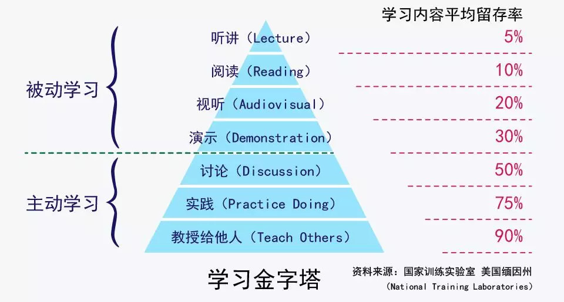

# 学习任务

## 夯实基础

- 笔记 typora，emoji表情配合使用

- 配合 GitHub 仓库使用 typora，使用工具 sourcetree，学习 git知识
  - 配合极客时间课程学习《玩转git三剑客》

把主机环境安装好，通过 mstsc 

## 第一天：基础学习

### 1. Linux 学习

- SSH工具：[MobaXterm](https://mobaxterm.mobatek.net/)
- **virtualbox/vmware** => Centos 7.4
- [Linux命令大全(手册)_Linux常用命令行实例详解_Linux命令学习手册](http://man.linuxde.net/)
- [Linux 简易教学 | 莫烦Python](https://morvanzhou.github.io/tutorials/others/linux-basic/)
- 书籍《快乐的Linux命令行》

### 2. docker 学习

- 概念 / 网络 / 基础命令 / docker-compose / Dockerfile / *docker swarm / Kubernetes（k8s）
- 容器化的概念
- 微服务的概念

## 第二天：语言入门

### 其他语言

PHP：tp, yii, laravel ...

Python：Djgong, flask

Java：Spring

### 历史

- SSH：Spring + Struct2 + Hibernate
- SSM：Spring + SpringMVC + Mybatis
- 微服务：
  - Spring官方：SpringBoot + SpringCloud（服务注册发现，负载均衡）
  - Alibaba：SpringBoot + Dubbo + Zookeepr

### 1. Java 基础

#### 学习任务

- 浙大翁恺 Java 系列，网易云课堂，中国大学生慕课网

  - 数据类型

  - 关键字

  - 类和接口

  - [集合框架（容器）](https://frank-lam.github.io/fullstack-tutorial/#/JavaArchitecture/02-Java集合框架)

    - ArrayList
    - LinkedArrayList
    - Vector
    - HashMap
    - ...

    

  - 并发编程

    - 多线程
    - ...

  - 设计模式（23种）

### 2. SpringBoot / Java web

#### 学习任务

- 开发工具学习：IntelliJ IDEA，学习破解

- 如何写一个 helloworld，入门程序
- SpringBoot 学习入门课程**《SpringBoot上篇：核心技术》**16小时15分钟
  - maven（依赖包管理工具，类似于 npm）
  - 如何启动 jar 包，如何部署，如何结合 Docker 来部署项目
  - Thymeleaf 可以跳过学习

#### 目标

- 写一个 RESTful 接口，一个单独的微服务

### 

### 3. RabbitMQ

#### 学习任务

- [RabbitMQ消息中间件极速入门与实战](https://www.imooc.com/learn/1042)

## 第三天：数据库学习

### 1. MySQL基础入门

- 《与MySQL的零距离接触》07小时49分钟
  - 工具：Navicat Premium 12，破解
  - 基础数据类型（char,varchar,text,int,tinyint,long,blob ... ）
  - SQL 基础语句
  - 存储引擎
    - InnoDB
    - MyISAM
    - CSV
    - Archive
    - ...
  - ER图

### 2. redis入门

- [Redis入门视频教程-慕课网（时长 2小时26分 ）](https://www.imooc.com/learn/839)

深入《Redis实战》

## 项目实战

- 基于 docker 的微服务异步消息队列（任务队列）
  - Linux -> CentOS
  - Docker
  - 异步消息队列：RabbitMQ
  - RESTful API
    - SpringBoot
      - Java
      - MySQL
      - Redis
  - Git 部署
  - 文档：Typora

