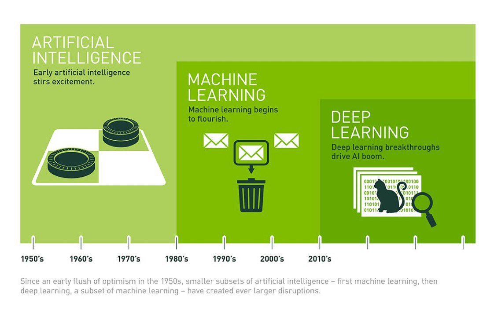

# 算法学习指南

时间：4 - 8 周

## 1. Python 语言基础

### 学习课程

-  🌞🌞 莫烦 Python
  - [基础教程系列 | 莫烦Python](https://morvanzhou.github.io/tutorials/python-basic/basic/)
  - 常见类库
    - [matplotlib](https://morvanzhou.github.io/tutorials/data-manipulation/plt/)
    - [Numpy](https://morvanzhou.github.io/tutorials/data-manipulation/np-pd/)
    - [Pandas](https://morvanzhou.github.io/tutorials/data-manipulation/np-pd/)
    - … etc.
-  🌞🌞🌞 极客时间（9小时）尹会生：[零基础学Python](https://time.geekbang.org/course/intro/98)

### 掌握

- python 基础语法
- 常见类库

## 2. 工具学习 IDE

-  🌞🌞🌞 Pycharm
-  🌞🌞🌞 [Project Jupyter | Home](https://jupyter.org/)

-  🌞🌞 [anaconda(开源的Python包管理器)](https://www.anaconda.com/)
-  🌞 Python 虚拟环境 `venv`

## 3. 机器学习

### 推荐课程

-  🌞🌞🌞 刘宇波（25小时）：[Python3入门机器学习_经典算法与应用-课程章节](https://coding.imooc.com/class/chapter/169.html#Anchor)
- 刘宇波配套代码：[liuyubobobo/Play-with-Machine-Learning-Algorithms](https://github.com/liuyubobobo/Play-with-Machine-Learning-Algorithms)

### 推荐书籍

-  🌞《机器学习实战》辅助

## 4. 深度学习

-  🌞🌞🌞 基础课程（2小时）：[深度学习之神经网络入门视频教程](http://www.imooc.com/learn/1063)，配合学习笔记：[深度学习初识 | Frank's 技术世界](https://www.frankfeekr.cn/2019/04/16/%E6%B7%B1%E5%BA%A6%E5%AD%A6%E4%B9%A0%E5%88%9D%E8%AF%86/#%E4%B8%89-tensorflow%E5%9F%BA%E7%A1%80)
-  🌞🌞🌞 实战课程（22小时）：[深度学习之神经网络_算法原理+实战-课程章节](https://coding.imooc.com/class/chapter/259.html#Anchor)
- 🌞🌞🌞 Tensorflow 入门：[TensorFlow快速入门与实战 | 极客时间](https://time.geekbang.org/course/intro/153)

## 5. 继续熟练 Python

- 🌞 爬虫
  - Scrapy (IP代理池)
- Web 框架(小众)
  - Django
  - Flask

## 开源项目

- [aymericdamien/TensorFlow-Examples: TensorFlow Tutorial and Examples for Beginners (support TF v1 & v2)](https://github.com/aymericdamien/TensorFlow-Examples)

...

## 参考工具

- [唧唧-哔哩哔哩唧唧-bilibili视频|弹幕在线下载](https://www.jijidown.com/)

