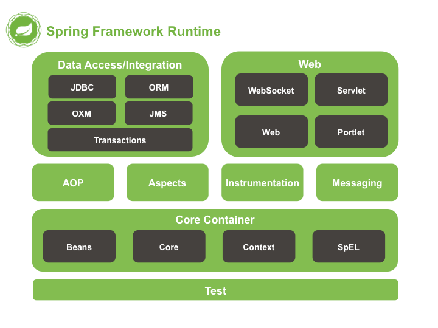
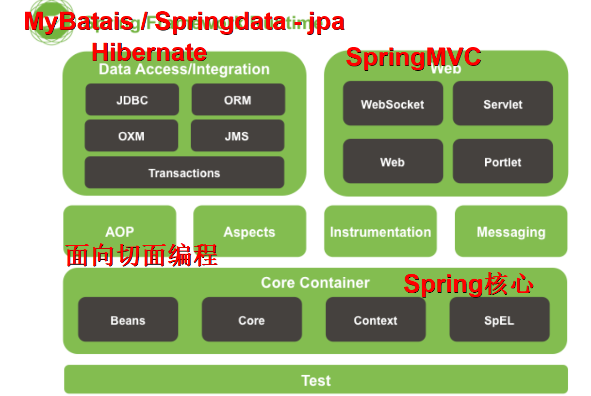
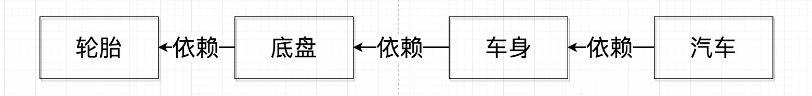
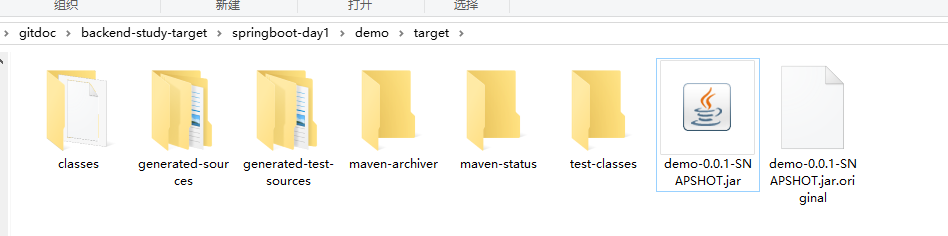

# 入门小程序

> 时间：2019年1月21日  20:00


## 目标

- SpringBoot 2.0x  + mvn + restful api
- mvn 打包（jar 包）
- docker 容器化部署到服务器


## 学习资料

[JeffLi1993/springboot-learning-example: spring boot 实践学习案例，是 spring boot 初学者及核心技术巩固的最佳实践。](https://github.com/JeffLi1993/springboot-learning-example)


## Spring 的前世今生






SSH（Spring + Struct2 + Hibernate）10年前

SSM（Spring + SpringMVC + MyBatis）

大量的 xml 配置文件，复杂，笨重


PHP：ThinkPHP , Laravel ,  YII

Python：Djongo , Flask

... 

快速，轻量级，开箱即用


微服务发展

SpringBoot：半开箱即用，`xml` 配置文件变成了注解方式 `@Autowired`

xxxAutoConfig 类对 xml 做了大量配置工作


Spring核心：

- AOP（面向切面编程）


- IOC（DI 依赖注入）控制反转

假设我们设计一辆汽车：先设计轮子，然后根据轮子大小设计底盘，接着根据底盘设计车身，最后根据车身设计好整个汽车。这里就出现了一个“依赖”关系：汽车依赖车身，车身依赖底盘，底盘依赖轮子。



这样的设计看起来没问题，但是可维护性却很低。假设设计完工之后，上司却突然说根据市场需求的变动，要我们把车子的轮子设计都改大一码。这下我们就蛋疼了：因为我们是根据轮子的尺寸设计的底盘，轮子的尺寸一改，底盘的设计就得修改；同样因为我们是根据底盘设计的车身，那么车身也得改，同理汽车设计也得改——整个设计几乎都得改！

我们现在换一种思路。我们先设计汽车的大概样子，然后根据汽车的样子来设计车身，根据车身来设计底盘，最后根据底盘来设计轮子。这时候，依赖关系就倒置过来了：轮子依赖底盘， 底盘依赖车身， 车身依赖汽车。


这时候，上司再说要改动轮子的设计，我们就只需要改动轮子的设计，而不需要动底盘，车身，汽车的设计了。

这就是依赖倒置原则——把原本的高层建筑依赖底层建筑“倒置”过来，变成底层建筑依赖高层建筑。高层建筑决定需要什么，底层去实现这样的需求，但是高层并不用管底层是怎么实现的。这样就不会出现前面的“牵一发动全身”的情况。


## SpringBoot 与 Maven

SpringBoot + MyBatis / JPA（持久层框架，保存到数据库）


依赖如何管理？

通过手动复制 jar 包的方式


包依赖管理工具：maven，类似于（前端：npm）

Maven 官方仓库：[Maven Repository: Search/Browse/Explore](https://mvnrepository.com/)


通过 Maven 实现对 Java 程序打包（.jar），跨平台可执行文件


## SpringBoot 程序是如何运行的？

SSH / SSM 通常情况在 tomcat 容器去启动我们的服务


SpringBoot 之后：

```shell
# 内嵌 tomcat 容器
java -jar api.jar
```


所以，使用 SpringBoot 就不需要使用外置 tomcat 容器


## 入门小程序

请参考 `demo` 文件夹下的代码


```shell
# jar 打包命令
mvn clean package
```





## Docker 容器化部署 `demo.jar`

详情见 day2

