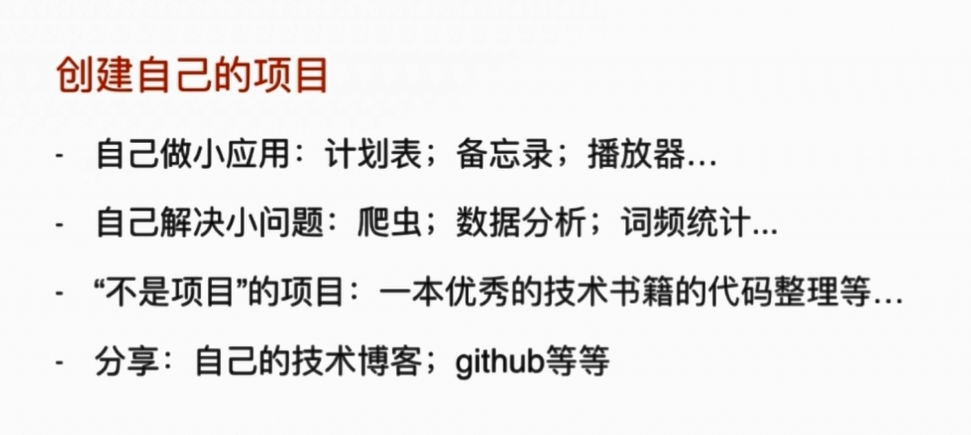

# 学习入门

bootstrap -> javascript / html / css

ElementUI -> Vue.js -> 官方文档 -> nodejs

去哪网实战课程

---

- Linux 命令 **《快乐的 Linux 命令行》**
  - 基础命令
    - cd , pwd, ll, ls -al, free -h, df -h, htop, yum(centos), apt-get, apt, vim, cat, head, tail, more, mount,  fidisk -l, rm, mkdir, cp, mv, zip, tar, parted, man, scp, wget, curl, shutdown -h now, reboot, echo, ps, netstat, lsof -i:80
  - shell 编程
    - startup.sh
  - Linux 目录结构
  - 基本概念

Docker 《Docker技术入门与实战（第3版）》

Git 《Git 三剑客》

Java 语法 -> 面向对象

SpringBoot [Spring Boot 中文文档](https://docshome.gitbooks.io/springboot/content/)

​	Maven

​	IDEA

SpringBoot 微信点餐实战

MySQL / Redis

​	SQL

学习路径：

1. 简单的学习视频快速入门
2. 实战
3. 文档/书籍 深入

