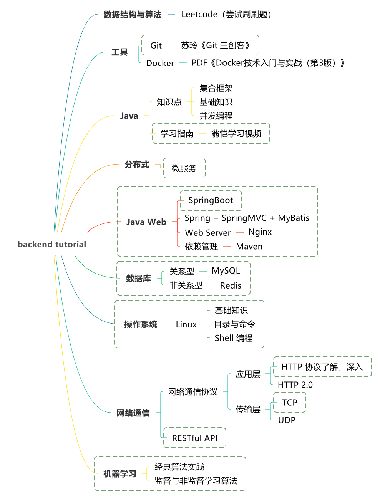
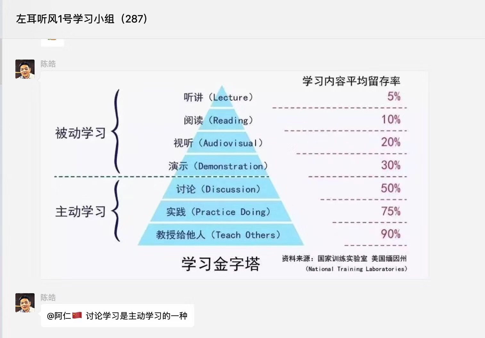

# 寒假学习任务

> 2019年1月25日 — 2019年2月12日

推荐阅读：[极客时间专栏 | geektime](http://geektime.biodwhu.cn/)

## 一、内功修炼 🔥🔥🔥

- Git 学习到进阶 🌞🌞🌞
  -  [ ] 【极客时间】玩转 Git 三剑客

- Linux 基础
  -  [ ] 【Linux运维工程师】Linux 达人养成计划 I-Linux的入门级课程！ 🌞🌞🌞
  -  [ ] 【Linux运维工程师】Linux 达人养成计划 II VIM+磁盘管理+用户权限！ 🌞🌞

- Docker 学习 🌞🌞
  -  [ ] [《Docker 从入门到实战》在线电子书](https://yeasy.gitbooks.io/docker_practice/content/introduction/)

## 二、Java 🔥🔥🔥

- Java 基础 / Java 容器 / Java 面向对象与设计模式 🌞🌞🌞
  -  [ ] 【网易云课堂】浙大翁恺基础视频

## 三、微服务 🔥🔥🔥

- Maven 🌞🌞
  -  [ ]  [【慕课在线视频】项目管理—maven-慕课网](https://www.imooc.com/learn/443)

- IntelliJ IDEA 开发工具学习 🌞🌞🌞
  -  [ ] [【慕课在线视频】IntelliJ IDEA神器使用技巧-慕课网](https://www.imooc.com/learn/924)

- 【硅尚谷】SpringBoot
  -  [ ] 【硅尚谷】SpringBoot 上篇 🌞🌞🌞
  -  [ ] 【硅尚谷】SpringBoot 下篇 🌞

- SpringBoot 实战课程 🌞🌞🌞
  -  [ ] 【慕课网】Spring Boot 微信点餐系统

- Nginx 🌞🌞
  -  [ ] 【极客时间】Nginx 核心知识 100 讲

- 微服务🌞
  -  [ ]  [《微服务：从设计到部署》在线电子书](https://github.com/DocsHome/microservices)

## 四、数据库 🔥🔥🔥

- MySQL 🌞🌞🌞
  -  [ ] 【慕课网】与 MySQL 的零距离接触

- Redis 🌞🌞
  -  [ ] 【慕课网】Redis 从入门到高可用，分布式实践

## 五、网络通信 🔥🔥

- HTTP 协议详解 🌞🌞
  -  [ ]  [GitHub 仓库在线阅读](https://github.com/frank-lam/fullstack-tutorial/blob/master/notes/%E8%AE%A1%E7%AE%97%E6%9C%BA%E7%BD%91%E7%BB%9C.md#%E7%AC%AC%E4%BA%8C%E9%83%A8%E5%88%86%E5%BA%94%E7%94%A8%E5%B1%82http)

- RESTful API 🌞🌞
  -  [ ] [GitHub 仓库在线阅读](https://github.com/frank-lam/fullstack-tutorial/blob/master/notes/RESTful%20API.md)

## 六、前端 🔥🔥

  -  [ ] 【慕课网】Vue2.5开发去哪儿网App 从零基础入门到实战项目 🌞🌞

## 六、机器学习

> 根据实际情况学习

- Python 学习 🐷🐷🐷
  -  [ ] 【莫凡】Python 基础入门

- 机器学习入门 🐷🐷🐷
  -  [ ] 【慕课网】Python3 入门机器学习 经典算法与应用
  -  [ ] PDF《机器学习实战》

## * Leetcode

> 有时间就学习吧 🐷

- [力扣 (LeetCode) 中国官网 - 全球极客挚爱的技术成长平台](https://leetcode-cn.com/)

# 思维导图

